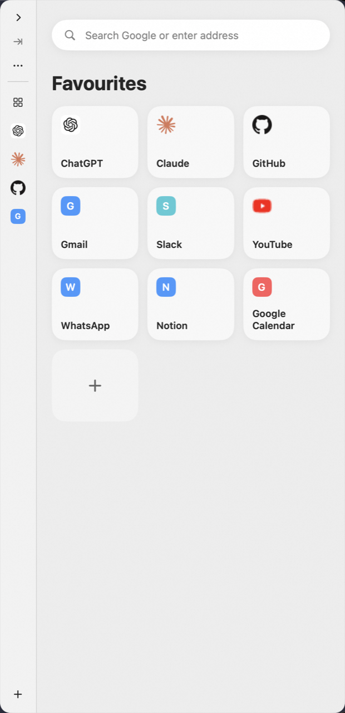

# SlideBrowser

**A mini browser that lives at the edge of your Mac screen.** Press <kbd>⌘E</kbd> anywhere — a panel slides in from the side with your pinned sites (ChatGPT, docs, mail…). Press <kbd>Esc</kbd> and you're back exactly where you were.

**[Download 1.0.1](https://github.com/xixifast/SlideBrowser/releases/latest/download/SlideBrowser-1.0.1-universal.zip)** · **[Website](https://slidebrowser.pages.dev)** · macOS 14+ · universal · Swift + AppKit + SwiftUI + WKWebView, zero third-party dependencies

<p align="center">
  
</p>

## Why

It's not a second Chrome — it's a web tool layer that appears and disappears instantly. The hard parts of a side browser aren't rendering pages (WebKit solved that); they're **panel behavior, focus restoration, Spaces/multi-display, session lifecycle, and web compatibility**. That's where this codebase spends its effort.

## Features

- **Global summon** — configurable hotkey (default ⌘E), works over full-screen apps, on every Space, on whichever display your pointer is on
- **Per-site global shortcuts** — record your own key (e.g. ⌘⇧G) to summon the panel with a specific site active
- **Sessions that survive** — cookies/logins persist via WebKit's default data store; suspended pages restore history and scroll position (`WKWebView.interactionState`)
- **Keep-alive + LRU** — pin hot sites in memory, everything else is recycled under a budget you control
- **Real browser behavior** — `target="_blank"`/OAuth popups inside the panel, file upload/download, JS dialogs, web-process crash recovery
- **Hidden chrome** — no tabs or toolbars; hover the top edge or hit ⌘L for the address bar
- **Private by design** — no analytics, no history collection, hosts never written to persistent logs ([policy](https://slidebrowser.pages.dev/privacy))

## Install

Grab the [latest release](https://github.com/xixifast/SlideBrowser/releases/latest), unzip, and move `SlideBrowser.app` to `/Applications`.

The build is not notarized yet, so the first launch needs one manual approval: **System Settings → Privacy & Security → Open Anyway**. Building from source avoids that entirely.

## Build & run

```bash
cd SlideBrowser
swift test          # 73 unit tests
./build.sh --debug  # assembles + ad-hoc signs build/SlideBrowser.app
open build/SlideBrowser.app
```

No Xcode project needed for development — plain SwiftPM. For App Store archiving, `project.yml` (XcodeGen) generates the project; see [`SlideBrowser/Distribution/RELEASING.md`](SlideBrowser/Distribution/RELEASING.md).

## Architecture

```
Sources/SlideBrowserKit/     all behavior, unit-testable
  Panel/      NSPanel slide-in, state machine, geometry (ratio-based, multi-display)
  HotKeys/    Carbon RegisterEventHotKey (sandbox-safe, no Accessibility permission)
  Browser/    WebSession lifecycle, NavigationPolicy (pure function), popups, downloads
  Sites/      site store (JSON), favicon fetcher (direct, negative-cached)
  Settings/   UserDefaults-backed store + SwiftUI settings
Sources/SlideBrowser/        thin executable bootstrap
Tests/                       swift-testing suites
```

The marketing site under [`website/`](website/) is static HTML/CSS deployed on Cloudflare Pages.

## License

[MIT](LICENSE)
